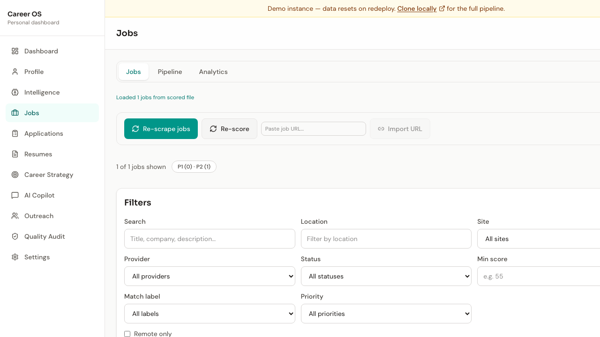
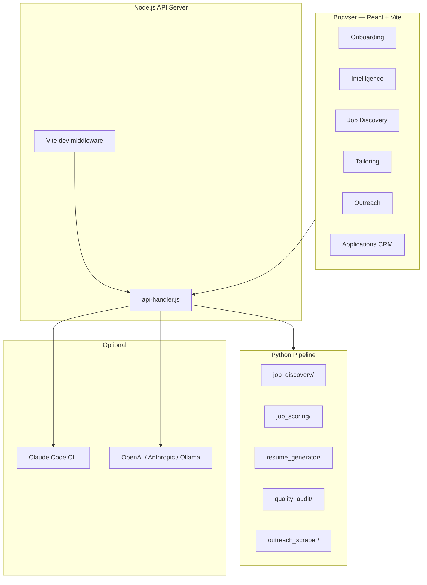

# Career OS

**Live demo:** [career-os-demo.onrender.com](https://career-os-demo.onrender.com)

<p align="center">
  <a href="https://career-os-demo.onrender.com">
    
  </a>
</p>

<p align="center"><em>Free Render instance — first load may take ~50s after idle.</em></p>

<!-- Record your Loom walkthrough and replace the placeholder link below with an embed iframe -->
<p align="center">
  <a href="https://www.loom.com/share/REPLACE_WITH_YOUR_LOOM_ID"><strong>▶ Watch 3-minute walkthrough</strong></a>
</p>
<!-- After recording, replace the link above with:
<p align="center">
  <iframe src="https://www.loom.com/embed/YOUR_LOOM_ID" frameborder="0" webkitallowfullscreen mozallowfullscreen allowfullscreen style="width:720px;height:405px;max-width:100%;"></iframe>
</p>
-->

<p align="center">
  <strong>Open-source, local-first job hunt automation for tech professionals.</strong><br>
  Discover jobs · Score fit · Tailor resumes · Draft outreach · Track applications — all on your machine.
</p>

<p align="center">
  <a href="LICENSE"></a>
  <a href="https://github.com/Shanupower/career-os"></a>
  
  
  
</p>

<p align="center">
  <a href="#quick-start">Quick start</a> ·
  <a href="#features">Features</a> ·
  <a href="#typical-workflow">Workflow</a> ·
  <a href="#cli-reference">CLI</a> ·
  <a href="#contributing">Contribute</a> ·
  <a href="docs/ROADMAP.md">Roadmap</a>
</p>

---

## Why Career OS?

Most job tools send your resume to the cloud, lock you into one job board, or give you a generic AI cover letter with invented metrics. **Career OS is different:**

| Principle | What it means |
|-----------|---------------|
| **Local-first** | Profile, intelligence, jobs, and tailored PDFs live in `data/` on your disk. Nothing leaves your machine unless you opt in to cloud AI. |
| **Deterministic scoring** | Six-dimension match scoring with adjustable weights you control in Settings. |
| **Provenance-checked tailoring** | Every resume claim is traced back to your profile; invented metrics are rejected. |
| **166+ company ATS boards** | Greenhouse, Lever, and Ashby configs for Stripe, Notion, Anthropic, Figma, and dozens more out of the box. |
| **Full pipeline** | Onboarding → Intelligence → Discovery → Scoring → Tailoring → Outreach → Quality audit → Applications CRM in one app. |

---

## Quick start

### Option A — npm (recommended)

```bash
git clone https://github.com/Shanupower/career-os.git
cd career-os
npm run setup          # Node deps + Python venv + Playwright browsers
npm run dev            # http://localhost:5173
```

### Option B — setup script

```bash
git clone https://github.com/Shanupower/career-os.git
cd career-os
bash setup.sh
npm run dev
```

### Option C — Docker

```bash
git clone https://github.com/Shanupower/career-os.git
cd career-os
docker compose up --build
```

Open **http://localhost:5173**. Complete onboarding, or go to **Settings → Load demo data** to explore with a fictional "Alex Dev" profile.

### Production mode

```bash
npm run start    # Builds SPA + serves full /api pipeline on port 5173
```

---

## Typical workflow

1. **Onboard** — Upload resume PDF or LinkedIn PDF export; answer the 17-question wizard; optionally scan GitHub repos.
2. **Review intelligence** — Role strategy, skills map, ATS keywords, and search queries are generated locally.
3. **Discover jobs** — Run ATS discovery (default `ats` group) or pick `remote`, `startup`, or `all`.
4. **Score & prioritize** — Jobs get P1/P2/P3 labels from six-dimension match scores; tune weights in Settings.
5. **Tailor assets** — One-click resume + cover letter per job (PDF, DOCX, JSON Resume, Markdown).
6. **Outreach** — Find contacts, draft messages, track follow-ups (safe search by default).
7. **Audit quality** — Batch-check job leads, resume provenance, ATS coverage, and outreach tone.
8. **Track applications** — Move jobs through saved → applied → interviewing → offer/rejected.

---

## Features

### Onboarding & profile

| Feature | Description |
|---------|-------------|
| **Resume PDF upload** | Local browser-side text extraction via PDF.js — no upload to any server |
| **LinkedIn PDF import** | Import your LinkedIn "Save to PDF" export; auto-maps experience, skills, and contact info |
| **17-question wizard** | Per-question progress ("Question 4 of 17"), back navigation, skills autofill from resume + GitHub scan |
| **GitHub repo scan** | Claude Code mines your repos for skills, metrics, and project summaries |
| **Profile editor** | Full name, roles, locations, remote preference, salary expectation |
| **Demo data** | One-click "Alex Dev" sample profile in Settings for exploring without your real data |

### Candidate intelligence

| Feature | Description |
|---------|-------------|
| **Role strategy** | Primary, secondary, stretch, and avoid roles from your questionnaire |
| **Skills map** | Technical skills bucketed: frontend, backend, database, cloud/DevOps, AI, leadership |
| **ATS keyword bank** | High/medium/supporting keywords for resume tailoring and scoring |
| **Search strategy** | Recommended queries for JobSpy, LinkedIn, and ATS discovery |
| **Scoring weights UI** | Six adjustable dimensions (role, skill, industry, experience, location, culture) in **Settings** with "Save & re-score" |

### Job discovery

Multi-provider scraping with configurable provider groups:

| Group | Providers | Best for |
|-------|-----------|----------|
| `ats` *(default)* | Greenhouse, Lever, Ashby | Top tech companies — works out of the box |
| `remote` | RemoteOK, We Work Remotely, JobSpy | Remote-first roles |
| `startup` | YC Work at a Startup, Wellfound, Ashby | Early-stage companies |
| `india` | Instahyre, Wellfound, JobSpy, Naukri | India-focused search |
| `all` | Every provider | Maximum coverage |
| `jobspy` | JobSpy only | Indeed, LinkedIn, Glassdoor via JobSpy |

**166+ preconfigured ATS companies** in [`companies/`](companies/) — Stripe, Notion, Coinbase, Anthropic, Figma, Netflix, Cursor, and more. [Add your own →](CONTRIBUTING.md#adding-ats-company-configs)

| Provider status | Notes |
|-----------------|-------|
| Greenhouse, Lever, Ashby | Production-ready; primary discovery path |
| RemoteOK, YC, We Work Remotely | Implemented; good for remote/startup groups |
| JobSpy | Requires `npm run setup:jobspy`; aggregates major boards |
| Naukri, Wellfound, Instahyre | Skeleton providers — community contributions welcome |

Other capabilities:

- Mock discovery mode for offline testing (`npm run discover:jobs:mock`)
- Import jobs by URL (Greenhouse, Lever, Ashby, generic pages)
- Pipeline orchestrator: discover → score → tailor in one flow
- Job filters, bulk actions, CSV/JSON export
- Live operation console with streamed logs

### Job scoring

| Feature | Description |
|---------|-------------|
| **Six-dimension scoring** | Role, skill, industry, experience, location, culture — weighted total 0–100 |
| **P1 / P2 / P3 priorities** | Auto-assigned from match score and red flags |
| **Red flag detection** | Avoid roles, thin descriptions, missing URLs cap scores |
| **Score breakdown** | Per-dimension raw score, weight, and weighted contribution in job detail drawer |
| **Re-score on demand** | Change weights in Settings → "Save & re-score jobs" |

### Resume & cover letter tailoring

| Output | Format |
|--------|--------|
| Resume | PDF, HTML, Markdown, **DOCX** (ATS-safe), **JSON Resume** |
| Cover letter | PDF, Markdown |

- **Claude Code enhanced** — AI-drafted summary, bullets, and cover letter (with provenance validation)
- **Rule-based fallback** — Works without any AI; still produces one-page PDFs
- **Single-page enforcement** — Automatic overflow ladder; never shrinks below 9.5pt body
- **Banned cliché lint** — Rejects "passionate", "team player", "fast-paced environment", etc.

### Outreach

| Feature | Description |
|---------|-------------|
| **Contact discovery** | Recruiters and hiring managers from job pages + LinkedIn search |
| **Safe search mode** *(default)* | DuckDuckGo public snippets — no LinkedIn login required |
| **Deep mode** *(opt-in)* | Authenticated LinkedIn people-search via `li_at` cookie — requires explicit ToS acknowledgment |
| **Message drafts** | Connection request, InMail, follow-up, thank-you templates |
| **Outreach CRM** | Per-job contacts, messages, activity timeline |

### AI copilot

Optional cloud or local AI providers (OpenAI, Anthropic, Ollama, OpenRouter, Gemini, Claude Code):

- Job fit analysis · Resume enhancement suggestions · Cover letter variants
- Interview prep questions · Outreach message drafts · Career strategy · Skill gap analysis
- Usage tracking, cost estimates, and per-feature toggles

### Quality audit

Batch audit across your pipeline:

- Job lead quality · Resume provenance · ATS keyword coverage
- Cover letter lint · Outreach message quality
- Exportable audit reports

### Applications CRM

Track every job through your funnel: saved → applied → interviewing → offer/rejected. Analytics tab with pipeline stats and follow-up reminders.

### Backup & portability

- **One-click backup** — Download `career-os-backup.zip` (profile + intelligence + jobs + resumes + outreach)
- **Restore** — Upload ZIP to restore full pipeline state across machines

---

## Architecture



| Layer | Tech |
|-------|------|
| Frontend | React 19, Vite 8, Tailwind CSS 4 |
| API | Node.js ESM, shared handler for dev + production |
| Pipeline | Python 3.11–3.12, Playwright, JobSpy, Jinja2, WeasyPrint |
| Data | `data/` on disk + browser localStorage |
| CI | GitHub Actions — lint, build, unit tests, smoke tests *(see [Enable CI](#enable-ci) below)* |

---

## Prerequisites

| Requirement | Required for |
|-------------|--------------|
| **Node.js 20+** | Frontend + API server |
| **Python 3.11–3.12** | Discovery, scoring, tailoring, audit |
| **Git** | Clones JobSpy and externals during setup |
| **~2 GB disk** | Playwright browsers + Python venv |
| **Claude Code CLI** *(optional)* | AI-enhanced resume/cover letter tailoring |
| **WSL2** *(Windows)* | Recommended for bash setup scripts |

---

## Configuration

Copy the environment template:

```bash
cp .env.example .env
```

| Variable | Description |
|----------|-------------|
| `PORT` | Server port (default `5173`) |
| `CLAUDE_AUTO_LOGIN` | Auto-open Terminal for Claude Code login on startup |
| `LINKEDIN_LI_AT` | LinkedIn session cookie for deep outreach mode (optional) |
| `OPENAI_API_KEY` | Cloud AI — or configure in Settings UI |
| `ANTHROPIC_API_KEY` | Cloud AI — or configure in Settings UI |

Cloud AI keys can also be set in **Settings → AI** without touching `.env`.

---

## CLI reference

```bash
# Setup & dev
npm run setup                  # Full setup (Node + Python + Playwright)
bash setup.sh                  # Same as above
npm run dev                    # Development server with hot reload
npm run start                  # Production build + server

# Pipeline
npm run discover:jobs          # Live ATS discovery (default: ats group)
npm run discover:jobs:mock     # Mock discovery (no network)
npm run score:jobs             # Score discovered jobs
npm run tailor:resumes         # Generate tailored resumes + cover letters
npm run scan:projects          # Scan GitHub repos for project intelligence
npm run audit:quality          # Run quality audit
npm run import:job             # Import a job from URL
npm run regenerate-intelligence # Rebuild intelligence from saved profile

# Testing & validation
npm test                       # Vitest (JS) + pytest (Python)
npm run validate:companies     # Validate companies/*.json configs
npm run lint                   # ESLint
npm run build                  # Production frontend build

# Optional AI
npm run claude:login           # Authenticate Claude Code CLI
```

---

## Data & privacy

All profile, job, resume, and outreach data stays **local**:

| Location | Contents |
|----------|----------|
| `data/profile/` | Candidate profile JSON |
| `data/intelligence/` | Role strategy, skills map, keywords |
| `data/jobs/` | Discovered and scored jobs |
| `data/resumes/` | Tailored resume/cover letter outputs |
| `data/outreach/` | Contacts and message drafts |
| Browser localStorage | Jobs cache, intelligence cache, UI state |

Nothing is sent to the cloud unless you configure optional AI API keys. Example fixtures in `data/examples/` use a fictional "Alex Dev" profile — safe to commit and share.

See [SECURITY.md](SECURITY.md) for vulnerability reporting and sensitive data guidance.

---

## LinkedIn deep mode — read this

Outreach includes an optional **deep mode** that automates linkedin.com with your `li_at` session cookie.

> **Warning:** This likely violates the [LinkedIn User Agreement](https://www.linkedin.com/legal/user-agreement) and can result in **permanent account suspension**. Career OS does not encourage ToS violations.

- **Default (recommended):** Safe search mode — public DuckDuckGo snippets, no login, no account risk.
- **Deep mode:** Requires UI consent (`acceptTosRisk`) + CLI flag `--i-accept-tos-risk`. Use at your own risk.

---

## Testing

```bash
npm test
```

| Suite | Covers |
|-------|--------|
| **Vitest** (4 tests) | `skillsClassifier.js` — skill bucketing and routing |
| **pytest** (8 tests) | `scorer.py` — weighted scoring, red flags; `provenance_checker.py` — metric verification |

CI runs lint, build, company validation, unit tests, and Python smoke tests (mock discovery + scoring) on every PR.

### Enable CI

The workflow file lives at `.github/workflows/ci.yml`. If your GitHub token lacks the `workflow` scope, push it after refreshing auth:

```bash
gh auth refresh -h github.com -s workflow
git add .github/workflows/ci.yml
git commit -m "Add CI workflow"
git push
```

---

## Troubleshooting

| Problem | Fix |
|---------|-----|
| `npm run setup` fails on Python | Use Python 3.11 or 3.12; ensure `python3` is on PATH |
| Discovery returns 0 jobs | Try `npm run discover:jobs:mock` first; then check network and `companies/*.json` slugs |
| Tailoring fails without AI | Rule-based mode still works; install Claude Code for enhanced output |
| Playwright errors | Re-run `npm run setup` or `npx playwright install` inside `.venv` |
| Port 5173 in use | Set `PORT=3000` in `.env` and restart |
| Jobs not showing in UI | Run discovery + scoring; check **Settings → Pipeline health** |

---

## Contributing

We welcome contributions — especially new company configs and job board providers!

```bash
# Add a company to companies/greenhouse.json (or lever.json / ashby.json)
node scripts/validate-companies.js
npm test
```

See [CONTRIBUTING.md](CONTRIBUTING.md) for the full guide, including how to find ATS board slugs.

**Roadmap:** [docs/ROADMAP.md](docs/ROADMAP.md) — salary intelligence, job alerts, browser extension, multi-profile support, and more.

**Changelog:** [CHANGELOG.md](CHANGELOG.md)

---

## Project structure

```
career-os/
├── src/                  # React frontend (dashboard, onboarding, jobs, outreach, CRM)
├── scripts/              # Node API server + pipeline runners
├── python/               # Discovery, scoring, tailoring, audit, outreach scraper
├── companies/            # 166+ ATS company configs (community-expandable)
├── data/examples/        # Demo profile, intelligence, scored jobs
├── tests/                # Vitest + pytest unit tests
├── requirements.txt      # Pinned Python dependencies
├── setup.sh              # One-command setup wrapper
├── Dockerfile            # Production container
└── docker-compose.yml    # docker compose up --build
```

---

## License

[GNU Affero General Public License v3.0](LICENSE) (AGPL-3.0)

If you deploy a modified version as a network service, you must provide source code to users of that service.

---

<p align="center">
  Built for engineers who want their job search pipeline on their own machine.<br>
  <a href="https://github.com/Shanupower/career-os">⭐ Star on GitHub</a> ·
  <a href="CONTRIBUTING.md">Contribute</a> ·
  <a href="docs/ROADMAP.md">Roadmap</a> ·
  <a href="SECURITY.md">Security</a>
</p>
